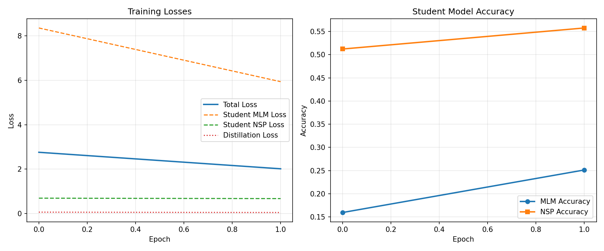
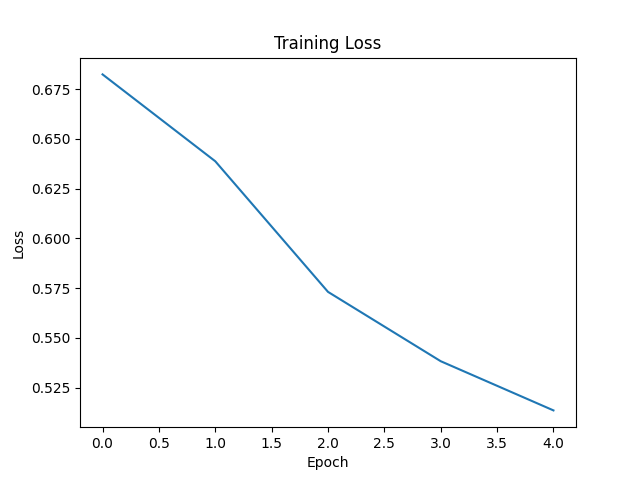
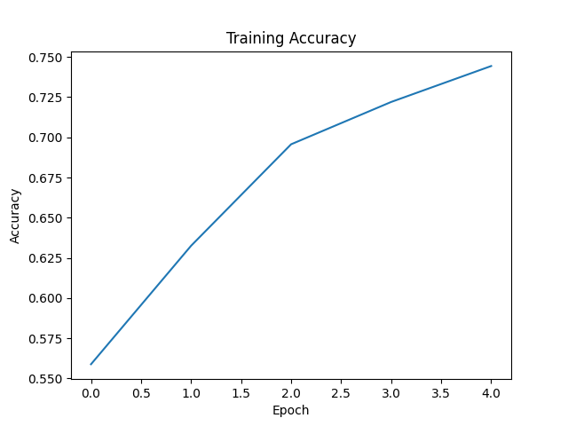

<p align="center">
  <h1 align="center">🧠 BERT From Scratch — PyTorch</h1>
  <p align="center">
    <em>A complete, from-scratch implementation of Google's <a href="https://arxiv.org/abs/1810.04805">BERT</a> in pure PyTorch — including pretraining, knowledge distillation, and downstream finetuning.</em>
  </p>
  <p align="center">
    
    
    
    
  </p>
</p>

---

## 🔍 Overview

This project is **not** a wrapper around HuggingFace's `transformers` library. Every component — from Multi-Head Self-Attention to Layer Normalization — is implemented **from the ground up** using only `torch.nn` primitives. The goal is to deeply understand the BERT architecture by building it piece by piece, then validating it through real pretraining, model compression via knowledge distillation, and downstream finetuning.

### ✨ Highlights

- **Zero black-box dependencies** — every Transformer building block is hand-written
- **Full pretraining pipeline** — Masked Language Modeling (MLM) + Next Sentence Prediction (NSP) on CNN/DailyMail
- **Knowledge Distillation** — compress BERT-Base (~110M) into a smaller student model using KL-divergence soft-target training
- **Finetuning pipeline** — sentiment classification on IMDb with accuracy/loss tracking
- **Inference script** — plug in any sentence and get a sentiment prediction
- **Configurable architecture** — easily scale from a tiny debug model to BERT-Base (110M params)

---

## 🏗️ Architecture

The model faithfully follows the original **BERT-Base** architecture from [Devlin et al., 2019](https://arxiv.org/abs/1810.04805):

```
Input Tokens
     │
     ▼
┌─────────────────────────────────┐
│  Token Embeddings               │
│  + Positional Embeddings        │  ──►  Summed & LayerNorm'd
│  + Segment (Token Type) Embeds  │
└─────────────────────────────────┘
     │
     ▼
┌─────────────────────────────────┐
│     Transformer Encoder ×N      │
│  ┌───────────────────────────┐  │
│  │  Multi-Head Self-Attention│  │
│  │  (Scaled Dot-Product)     │  │
│  └──────────┬────────────────┘  │
│        Add & LayerNorm          │
│  ┌──────────┴────────────────┐  │
│  │  Feed-Forward Network     │  │
│  │  (Linear → GELU → Linear)│  │
│  └──────────┬────────────────┘  │
│        Add & LayerNorm          │
└─────────────┬───────────────────┘
              │
     ┌────────┴────────┐
     ▼                 ▼
 [CLS] Pooler     All Token Outputs
     │                 │
     ▼                 ▼
  NSP Head          MLM Head
 (Linear→2)    (Dense→GELU→Norm→Vocab)
```

### Model Configurations

| Config | Hidden Size | Layers | Heads | FFN Dim | Parameters |
|---|---|---|---|---|---|
| **Teacher (BERT-Base)** | 768 | 12 | 12 | 3072 | ~110M |
| **Student (Distilled)** | 384 | 4 | 6 | 1536 | ~28M |

---

## 📁 Project Structure

```
BERT_scratch_pytorch/
│
├── config_bert.py                  # Hyperparameter configuration class
├── model_parts.py                  # Core building blocks:
│                                   #   LayerNorm, FeedForward, SelfAttention,
│                                   #   MultiHeadAttention, Encoder, EncoderStack
├── BERT.py                         # Full BERTModel with MLM + NSP heads
│
├── train_bert.py                   # Pretraining (MLM + NSP on CNN/DailyMail)
├── distilled_bert.py               # Knowledge Distillation (Teacher → Student)
├── finetune_for_classification.py  # Finetuning on IMDb sentiment classification
├── test.py                         # Inference script for sentiment prediction
│
└── artifacts/
    ├── bert_base/                  # Teacher pretraining checkpoints & plots
    │   ├── bert_epoch_*.pt
    │   ├── loss.png
    │   └── accuracy.png
    ├── bert_distilled/             # Student distillation checkpoints & plots
    │   ├── student_epoch_*.pt
    │   ├── training_metrics.png
    │   └── config.json
    ├── accuracy.png                # Finetuning accuracy curve
    └── loss.png                    # Finetuning loss curve
```

---

## ⚙️ How It Works

### 1️⃣ Pretraining — Learning Language

The **BERT-Base teacher model** (768d, 12 layers, 12 heads) is pretrained on the [CNN/DailyMail](https://huggingface.co/datasets/cnn_dailymail) dataset using two self-supervised objectives:

| Objective | What It Learns |
|---|---|
| **Masked Language Modeling (MLM)** | 15% of input tokens are randomly masked. The model predicts the original token from bidirectional context. |
| **Next Sentence Prediction (NSP)** | Given two sentences, the model predicts whether sentence B actually follows sentence A (50/50 split). |

**MLM masking strategy** (following the original paper):
- 80% of selected tokens → replaced with `[MASK]`
- 10% → replaced with a random token
- 10% → left unchanged

**Training details:**
- Tokenizer: `bert-base-uncased` WordPiece vocabulary (30,522 tokens)
- Optimizer: AdamW
- Checkpointing: model + optimizer state saved every epoch

```bash
python train_bert.py
```

---

### 2️⃣ Knowledge Distillation — Compressing the Model

After pretraining, the large teacher model's knowledge is transferred to a **smaller student model** using knowledge distillation, inspired by [DistilBERT (Sanh et al., 2019)](https://arxiv.org/abs/1910.01108).

```
┌──────────────────┐         ┌──────────────────┐
│  TEACHER (frozen) │         │  STUDENT          │
│  768d, 12 layers  │         │  384d, 4 layers   │
│  ~110M params     │         │  ~28M params      │
└────────┬─────────┘         └────────┬─────────┘
         │                            │
         │   Soft Targets             │   Predictions
         │   (softmax / T)            │   (softmax / T)
         └──────────┬─────────────────┘
                    │
                    ▼
            ┌──────────────┐
            │  KL Divergence│  ← Distillation Loss (α)
            └──────────────┘
                    +
            ┌──────────────┐
            │  CrossEntropy │  ← Hard-Target Loss (1-α)
            └──────────────┘
                    =
              Total Loss
```

**How the distillation loss works:**

| Component | Description | Weight |
|---|---|---|
| **KL Divergence (soft targets)** | Student learns to mimic the teacher's full probability distribution over the vocabulary, softened with temperature T=3.0 | α = 0.7 |
| **Cross-Entropy (hard targets)** | Student also learns from the ground-truth MLM + NSP labels directly | 1−α = 0.3 |

**Key design choices:**
- Distillation is applied to **both** MLM and NSP output heads
- KL divergence is computed only on **masked positions** (not padding) for MLM
- Temperature softening (T=3.0) reveals the teacher's "dark knowledge" — its uncertainty across similar tokens
- Gradient clipping (max norm 1.0) for stable training

**Student architecture:**
- Hidden dim: 384 (half of teacher)
- Layers: 4 (⅓ of teacher)
- Attention heads: 6 (half of teacher)
- **~4× compression** with knowledge retention

```bash
python distilled_bert.py
```

The script also includes an **evaluation function** that benchmarks student vs. teacher on MLM/NSP accuracy and reports performance retention percentages.

---

### 3️⃣ Finetuning — Sentiment Classification

After pretraining, the model is finetuned for **binary sentiment classification** on the [IMDb](https://huggingface.co/datasets/imdb) movie review dataset (25K train / 25K test):

- The pretrained BERT encoder is loaded from checkpoint
- A classification head (`Linear → 2 classes`) is attached to the `[CLS]` pooled output
- The entire model (encoder + classifier) is finetuned end-to-end

```bash
python finetune_for_classification.py
```

### 4️⃣ Inference

Run predictions on custom text inputs:

```bash
python test.py
```

```
Text: This movie was not bad
Prediction: Positive
Probabilities: [[0.32, 0.68]]
```

---

## 📊 Training Results

### Knowledge Distillation (Student)

<p align="center">
  
</p>

### Finetuning (Sentiment Classification)

<p align="center">
  
  &nbsp;&nbsp;
  
</p>

---

## 🚀 Quick Start

### Prerequisites

```bash
pip install torch transformers datasets tqdm matplotlib
```

### Run the Full Pipeline

```bash
# Step 1: Pretrain BERT-Base (teacher) on CNN/DailyMail
python train_bert.py

# Step 2: Distill into a smaller student model
python distilled_bert.py

# Step 3: Finetune on IMDb sentiment dataset
python finetune_for_classification.py

# Step 4: Run inference
python test.py
```

---

## 🧩 Key Implementation Details

### Custom Layer Normalization
Implemented from scratch using learnable `α` (scale) and `β` (shift) parameters — no `torch.nn.LayerNorm` dependency.

### Scaled Dot-Product Attention
Each attention head computes:

$$\text{Attention}(Q, K, V) = \text{softmax}\left(\frac{QK^T}{\sqrt{d_k}}\right)V$$

with support for attention masking (padding tokens).

### Weight Tying
The MLM output projection **shares weights** with the token embedding matrix, reducing parameter count and improving generalization (as proposed in [Press & Wolf, 2017](https://arxiv.org/abs/1608.05859)).

### Residual Connections
Every sub-layer (attention and feed-forward) uses **Add & Norm** residual connections to enable stable training of deep encoder stacks.

### Knowledge Distillation Loss
A custom `DistillationLoss` module combines:
- **KL divergence** on temperature-softened logits (captures inter-class relationships the teacher learned)
- **Cross-entropy** on hard labels (anchors the student to ground truth)
- Weighted combination controlled by `α` hyperparameter

---

## 🛠️ Customize the Architecture

Easily change the model size by modifying `config_bert.py`:

```python
# BERT-Tiny (for debugging)
cfg = BERT_config(d_model=128, num_layers=2, n_heads=2)

# BERT-Base (original paper)
cfg = BERT_config(d_model=768, num_layers=12, n_heads=12)

# BERT-Large
cfg = BERT_config(d_model=1024, num_layers=24, n_heads=16)
```

---

## 📚 References

- [BERT: Pre-training of Deep Bidirectional Transformers for Language Understanding](https://arxiv.org/abs/1810.04805) — Devlin et al., 2019
- [Attention Is All You Need](https://arxiv.org/abs/1706.03762) — Vaswani et al., 2017
- [DistilBERT, a distilled version of BERT](https://arxiv.org/abs/1910.01108) — Sanh et al., 2019
- [Distilling the Knowledge in a Neural Network](https://arxiv.org/abs/1503.02531) — Hinton et al., 2015
- [Using the Output Embedding to Improve Language Models](https://arxiv.org/abs/1608.05859) — Press & Wolf, 2017

---

## 📄 License

This project is available under the [MIT License](LICENSE).

---

<p align="center">
  <strong>Built from scratch to learn, understand Transformers.</strong><br>
  ⭐ Star this repo if you found it helpful!
</p>
